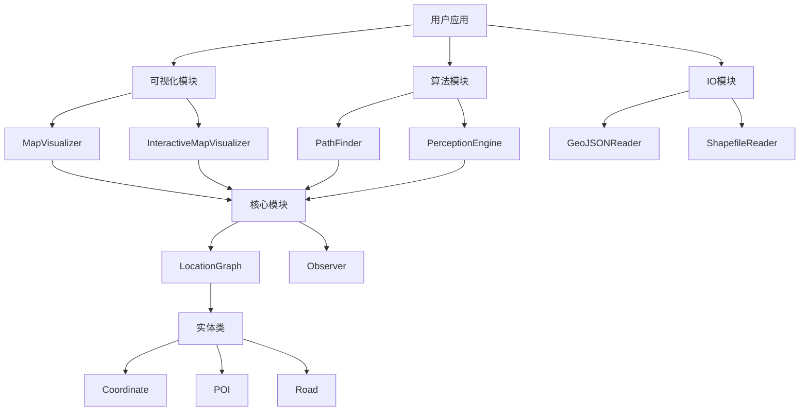

# 系统架构图

主要组件说明：
1. **核心模块**：提供基础数据结构和功能
   - LocationGraph: 地理空间网络图
   - Observer: 智能体观察者

2. **实体类**：表示地理空间对象
   - Coordinate: 地理坐标
   - POI: 兴趣点
   - Road: 道路

3. **算法模块**：提供核心算法
   - PathFinder: 路径规划
   - PerceptionEngine: 环境感知

4. **IO模块**：数据读写
   - GeoJSONReader: GeoJSON格式支持
   - ShapefileReader: Shapefile格式支持

5. **可视化模块**：数据可视化
   - MapVisualizer: 静态可视化
   - InteractiveMapVisualizer: 交互式可视化